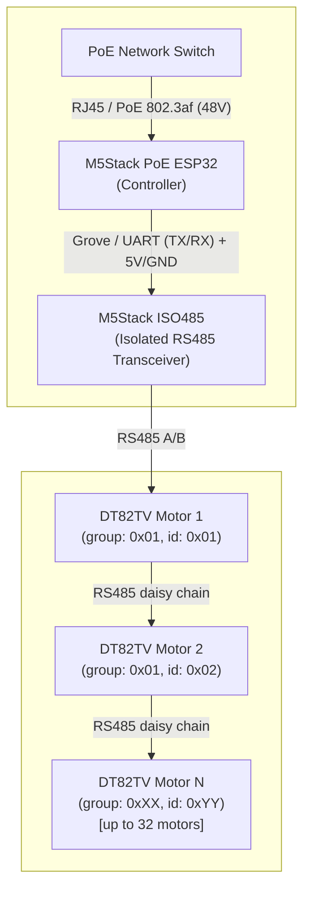

## Why DT82TV?

Well one short answer - wire is king. Although his motor can be controlled via RF remote or even without the remote at all by pulling the curtain to soft-start the opening/closing, the best feature it has is the RS485 connection port, which allows to control multiple (up to 32) DT82TV or similar motors with a single pair of wires - no WiFi or Zigbee or other wireless bullshit needed, simple reliable plain old wire.

### Required components

| Component | Description | Link |
|-----------|-------------|------|
| Dooya DT82TV | RS485 curtain motor, up to 32 per bus | [manuals.plus](https://manuals.plus/ae/3256808861904878) |
| M5Stack PoE ESP32 | ESP32-based PoE controller | [docs.m5stack.com](https://docs.m5stack.com/en/unit/poesp32) |
| M5Stack ISO485 | Isolated RS485 transceiver unit | [docs.m5stack.com](https://docs.m5stack.com/en/unit/iso485) |

### Wiring diagram



## ESPHome

The controller runs ESPHome using a custom `dooya` component available at [ItsRebaseTime/esphome-rs485-motors](https://github.com/ItsRebaseTime/esphome-rs485-motors).

The component exposes a `cover` entity for open/close/stop control, diagnostic `button` entities, an address `text` input, a status `text_sensor`, and `switch` entities for motor behaviour options.

```yaml
external_components:
  - source: github://ItsRebaseTime/esphome-rs485-motors@address_change
    components: [ uart_multi, dooya ]
    refresh: 0s

uart:
  id: gree_uart
  tx_pin: 16
  rx_pin: 17
  baud_rate: 9600

cover:
  - platform: dooya
    name: "All curtains"
    id: all_curtains
    address: 0x0000
    device_class: curtain

  - platform: dooya
    name: "Right curtain"
    id: right_curtain
    address: 0x0102
    device_class: curtain

  - platform: dooya
    name: "Left curtain"
    id: left_curtain
    address: 0x0101
    device_class: curtain

button:
  - platform: dooya
    type: get_status
    dooya_id: left_curtain
    name: "Left curtain get status"
  - platform: dooya
    type: clear_positioning
    dooya_id: left_curtain
    name: "Left curtain clear positioning"
  - platform: dooya
    type: factory_reset
    dooya_id: left_curtain
    name: "Left curtain factory reset"

  - platform: dooya
    type: get_status
    dooya_id: right_curtain
    name: "Right curtain get status"
  - platform: dooya
    type: clear_positioning
    dooya_id: right_curtain
    name: "Right curtain clear positioning"
  - platform: dooya
    type: factory_reset
    dooya_id: right_curtain
    name: "Right curtain factory reset"

  - platform: dooya
    type: change_address 
    dooya_id: all_curtains
    name: "Change Address"

text:
  - platform: dooya
    name: "Address Input"
    dooya_id: all_curtains
    mode: TEXT

text_sensor:
  - platform: dooya
    dooya_id: all_curtains
    name: "Address change status"

switch:
  - platform: dooya
    type: invert_direction
    dooya_id: left_curtain
    name: "Left curtain invert direction"
  - platform: dooya
    type: invert_direction
    dooya_id: right_curtain
    name: "Right curtain invert direction"
  - platform: dooya
    type: pull_to_start
    dooya_id: all_curtains
    name: "All curtains pull to start"
```

## ESP-NOW remote control

You can control the curtain controller from a battery-powered ESP32 remote over ESP-NOW, without Wi-Fi association on the remote.

The simplest packet format is one command byte:

- `0x01` = open
- `0x02` = stop
- `0x03` = close

### Controller YAML additions (receiver)

Add an `id` to the `cover` and configure `espnow` to accept packets from the remote MAC address:

```yaml
cover:
  - platform: dooya
    id: dooya_curtain
    name: Dooya Curtain
    address: 0xFEFE
    device_class: curtain

espnow:
  auto_add_peer: false
  peers:
    - FF:EE:DD:CC:BB:AA  # remote MAC
  on_receive:
    - address: FF:EE:DD:CC:BB:AA
      then:
        - lambda: |-
            if (size < 1) {
              return;
            }
            auto call = id(dooya_curtain).make_call();
            switch (data[0]) {
              case 0x01:
                call.set_command_open();
                break;
              case 0x02:
                call.set_command_stop();
                break;
              case 0x03:
                call.set_command_close();
                break;
              default:
                return;
            }
            call.perform();
```

### Remote YAML example (sender)

This example uses three physical buttons and sends one-byte commands to the controller MAC address.

```yaml
espnow:
  channel: 1
  auto_add_peer: false
  peers:
    - 11:22:33:44:55:66  # controller MAC

binary_sensor:
  - platform: gpio
    pin:
      number: GPIO18
      mode: INPUT_PULLUP
      inverted: true
    name: Remote Open Button
    on_press:
      - espnow.send:
          address: 11:22:33:44:55:66
          data: [0x01]

  - platform: gpio
    pin:
      number: GPIO19
      mode: INPUT_PULLUP
      inverted: true
    name: Remote Stop Button
    on_press:
      - espnow.send:
          address: 11:22:33:44:55:66
          data: [0x02]

  - platform: gpio
    pin:
      number: GPIO21
      mode: INPUT_PULLUP
      inverted: true
    name: Remote Close Button
    on_press:
      - espnow.send:
          address: 11:22:33:44:55:66
          data: [0x03]
```

### Setup steps

1. Flash and verify the main curtain controller first (RS485 + `dooya` cover works from Home Assistant).
2. Find MAC addresses for both ESP32 devices (controller and remote) from logs or your router/switch tooling.
3. Replace `FF:EE:DD:CC:BB:AA` in the controller config with the remote MAC.
4. Replace `11:22:33:44:55:66` in the remote config with the controller MAC.
5. If you set a fixed ESP-NOW `channel` on the remote, keep both devices on the same channel.
6. Flash the controller config, then flash the remote config.
7. Test buttons: open, stop, close. If packets are not received, verify MAC addresses and channel settings first.

## Address changing procedure

Each motor must be assigned a unique two-byte address (group + id) before being added to the bus. The procedure can be done via the home assistant by going to the esphome device configured with the yaml above and must be performed **one motor at a time**.

1. Connect the RS485 adapter to the motor. Make sure **only one motor** is on the bus and it is **powered**.
2. Think what addresses and groups you would like to assign. For example select a group for each room if you have only one motor per window and select group for each window if you have two motors per window. The group is not that important since you still will be able to group the covers inside the home assistant.
Just a note: neither `ID_L` nor `ID_H` may be `0x00` or `0xFF`. 
For example, to assign group `0x42`, id `0x43` into `Dooya Curtain Address Input` enter:
  ```
  4243
  ```
3. Power on the Dooya motor.
5. Press and hold the setup button on the motor for **5 seconds** until the LED flashes twice. The button is located on the same side as the LED, opposite the connector end of the DT82TV.
6. Within **10 seconds** of the LED flashing twice, click **Dooya Curtain Change Address** button in the home assistant.
7. If successful, the motor LED flashes **5 times**.

Repeat the procedure for each motor, assigning a unique address each time, before connecting them all together on the shared RS485 bus.

